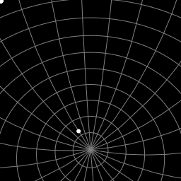

# Starmap

A D3 component for displaying star catalogs and selecting individual stars.



``` Javascript
    let svg = d3.select('svg');
    let width = svg.attr("width");
    let height = svg.attr("height");
    let stars = [
        // Vega
        {Name:"alpha Lyr", ra:"18.6156492", dec:"38.7836898",
            pmRA:"201.7", pmDE:"286.67", plx:"128.93", Vmag:"0.03"},
        // Canopus
        {Name:"alpha Car", ra:"6.39919703", dec:"-52.6956611",
            pmRA:"19.37", pmDE:"23.27", plx:"10.43", Vmag:"-0.62"}
    ];
    let starmap = createStarmap(svg, width, height)
        .click( function( star ) { console.log( star ); } )
        .move( function( point ) { console.log( starmap.screenToCelestial( point ) ); } )
        .magnitude( [-1, 6] )
        .catalog( stars );
    starmap();
```

# Examples

An example showing the [FK6 Star Catalog is available](https://caseyshields.github.io/starmap/index.html). FK6 is a selection of astrometrically excellent stars tied to the [ICRS](https://en.wikipedia.org/wiki/International_Celestial_Reference_System). It is often used to calibrate telescopes at optical wavelengths. It was compiled from the Hipparcos catalog and long term ground based measurements, and is known to be accurate to a milliarcsecond.

*TODO add Yale bright star catalog example for a more natural looking sky*

# Starmap API

Catalogs are loaded as arrays of json objects.
Any epoch can be used as long as all the entries are consistent.
Each entry must contain;

Member | Type | Meaning
-|-|-
ra | Floating point | Celestial right ascension in hours, 0.0 - 24.0
dec | Floating point | Declination in degrees, -90.0 to +90.0
vm | Floating Point | Visual magnitude


